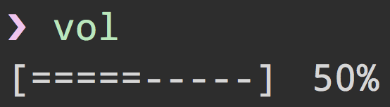

# vol-cli

> Get and set sound volume


## Install

```
$ npm install --global vol-cli
```


## Usage



```
$ vol --help

  Usage
    $ vol (Interactive CLI)
    $ vol <level>
    $ vol mute

  Examples
    $ vol 65
```

If encountering any problems in Windows, use the `volume` alias.


## Related

* [vol](https://github.com/gillstrom/vol) - API for this module


## License

MIT © [Andreas Gillström](http://github.com/gillstrom)
